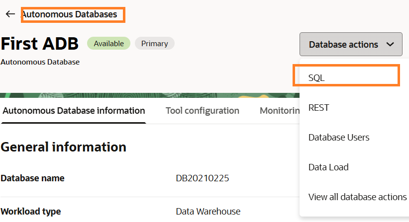
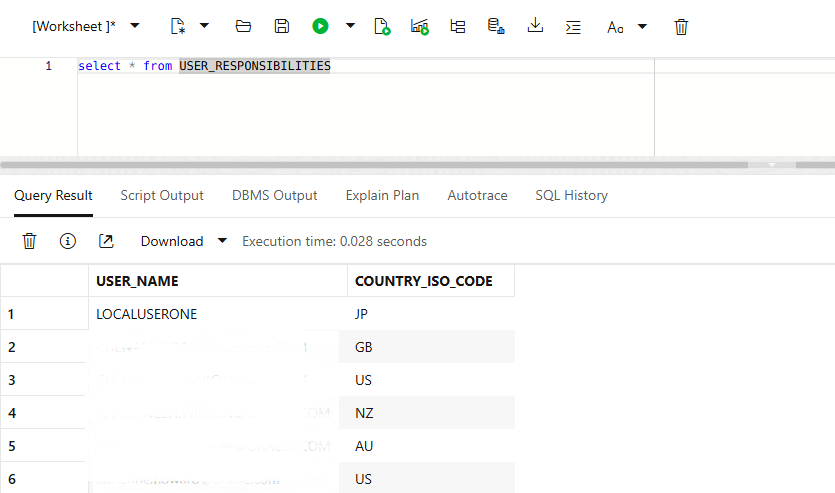

# Configure Workbook with AI Agent

## Introduction

In this lab, you will integrate the AI agent directly into an OAC workbook, making its capabilities accessible within a familiar dashboard environment. This allows users to seamlessly transition from visual exploration to conversational insights without leaving the workbook.

Estimated Time: 10 minutes

### Objectives

In this lab, you will:
* Configure the security table in ADB.
* Test the security table.

### Prerequisites 

This lab assumes you have:
* An Oracle Cloud account
* You have a running ADB instance


## Task 1: Configure the security table

1. Navigate to the Database Schema.

	

	> **Note:** You can use any SQL interface of your choice (SQL Developer, Toad, Database Actions and etc).

2. Copy and paste the SQL Code in the worksheet and execute.
 
   ```
  <copy>
      CREATE TABLE ADMIN.USER_RESPONSIBILITIES 
  (
  USER_NAME VARCHAR2(80) 
  , COUNTRY_ISO_CODE VARCHAR2(20) 
  );

  INSERT INTO "ADMIN"."USER_RESPONSIBILITIES" (USER_NAME, COUNTRY_ISO_CODE) VALUES ('LOCALUSERONE', 'JP');
  INSERT INTO "ADMIN"."USER_RESPONSIBILITIES" (USER_NAME, COUNTRY_ISO_CODE) VALUES ('CHEN.JAR', 'US');
  INSERT INTO "ADMIN"."USER_RESPONSIBILITIES" (USER_NAME, COUNTRY_ISO_CODE) VALUES ('JUDE.WIL', 'NZ');
  INSERT INTO "ADMIN"."USER_RESPONSIBILITIES" (USER_NAME, COUNTRY_ISO_CODE) VALUES ('JUDE.WIL', 'AU');
  INSERT INTO "ADMIN"."USER_RESPONSIBILITIES" (USER_NAME, COUNTRY_ISO_CODE) VALUES ('ADRIE.HOW', 'US');

  COMMIT;
  </copy>
    ```

## Task 2: Test the security table

1. Test your table is configured by writing a **select** SQL statement.

  

You may now **proceed to the next lab.**

## Learn More
* [SQL Developer Web](https://docs.oracle.com/en/cloud/paas/autonomous-database/serverless/adbsb/connect-database-actions.html#GUID-C32A78E5-4C5F-476F-86AB-AEEEA9CF2704)

## Acknowledgements
* **Author** - Chenai Jarimani, Cloud Architect, ONA
* **Last Updated By/Date** - Chenai Jarimani, May 2026
