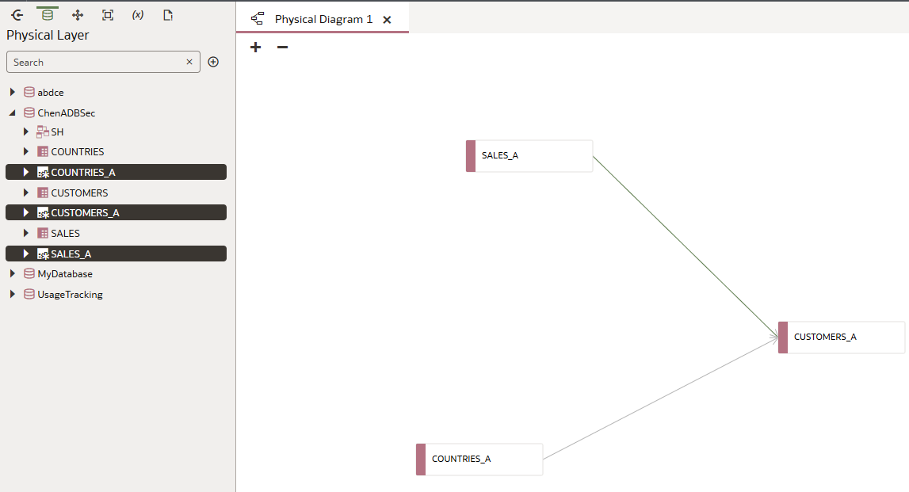
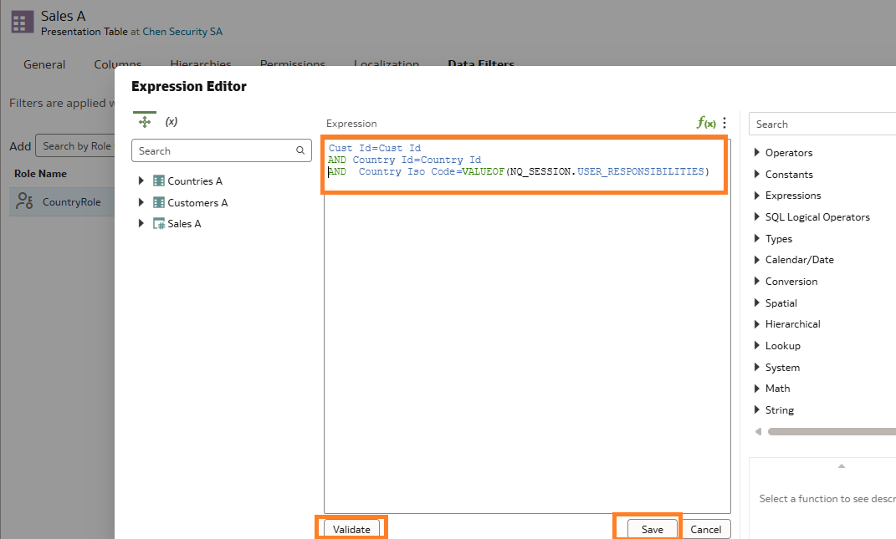

# Configure Security

## Introduction

This lab walks you through the steps to configure the security in the semantic modeler using the application roles and session variables defined in the previous tasks to filter the data. The Data Filter is where the expression is created that is appended to the OAC Where clause for each query.
Please note Data Filters are not executed for users who explicitly or implicitly have the BI Service Administrator role.

Estimated Time: 20 minutes

### Objectives

In this lab, you will:
* Identify the tables
* Objective 2
* Objective 3

### Prerequisites (Optional)

*List the prerequisites for this lab using the format below. Fill in whatever knowledge, accounts, etc. is needed to complete the lab. Do NOT list each previous lab as a prerequisite.*

This lab assumes you have:
* Working knowledge of the Semantic Modeler
* Modeled a few tables to apply the RL Security


*This is the "fold" - below items are collapsed by default*

## Task 1:  Create a Data Filter on the Countries Table

In this scenario i have Countries, Customers and Sales tables already modeled in the SM. The goal is to aTask 1 opening paragraph.

1. Review the joins of the 3 tables

	

	> **Note:** The COUNTRIES table is secured.  It is also secured with a join to the SALES table. The COUNTRY_ISO_CODE values are used to filter the data returned to an OAC query.

2. Navigate to Presentation Layer , then double click Countries table, then **Click** Data Filters

  

3. Under **Add** search for the CountryRole that was created in Lab 3.

  click **Navigation**.

4. Click CountryRole, then fx and Open Expression Editor and enter below code

   ```
      	<copy>Country Iso Code"=VALUEOF(NQ_SESSION.USER_RESPONSIBILITIES) <copy></copy>.</copy>
    ```

     
5. Click **Validate** and then **Save** 

 

> **Note:** A data filter is created on the COUNTRIES table to restrict what rows are returned to the user.  

 

## Task 2:  Create a Data Filter on the Sales Table

In case the user does not choose the COUNTRIES table for the analysis, the SALES table needs to be filtered so sales totals are displayed only for the countries the user is entitled to see. The appropriate joins to the COUNTRIES table are added to the filter.

1. Navigate to Presentation Layer , then double click Sales table, then **Click** Data Filters

  

2. Add the below using the expression builder:

    - Click **Sales** table -> **Cust ID** then Type (=)
    - Click **Customers** table -> **Cust ID** then Click AND
    - Click **Customers** table -> **Country ID** then Type (=)
    - Click **Countries** table -> **Country ID** then Click AND 
    - Click **Countries** table -> **Country ISO CODE** then Type (=)

    **Enter** VALUEOF(NQ_SESSION.USER_RESPONSIBILITIES)

 

3. Click Validate and Save 


 **Note:** A data filter is created on the SALES table with joins to the CUSTOMERS and COUNTRIES tables

4. Save the Semantic Modeler, check consistency and deploy

 


## Task 3:  Validate Data Level Security

 1. Sign in as ABC

 

 2. Create a Project

 

 3. Create an Analysis

 

 4. View the Session Log

 

## Learn More

*(optional - include links to docs, white papers, blogs, etc)*

* [URL text 1](http://docs.oracle.com)
* [URL text 2](http://docs.oracle.com)

## Acknowledgements
* **Author** - <Name, Title, Group>
* **Contributors** -  <Name, Group> -- optional
* **Last Updated By/Date** - <Name, Month Year>
